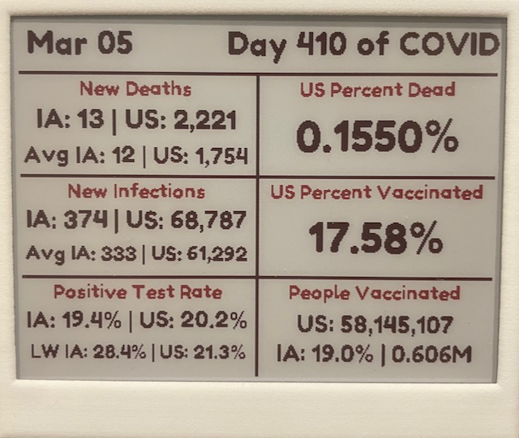

# Inky COVID Dashboard

A little dashboard that shows some stats about COVID-19 infections, deaths, and vaccinations. A "fun" little project for holiday break :)

## Example dashboard

  

## Software
- Infection and deaths data comes from the great [Covid Tracking Project](https://covidtracking.com).
- Vaccination data currently comes from [Our World in Data](https://github.com/owid/covid-19-data).
- Display visuals are created using the `inky` library that is provided by the makers of the display. 

## Hardware
- [Raspberry Pi Zero](https://www.raspberrypi.org/products/raspberry-pi-zero-w/)
- [Inky wHAT e-ink display](https://shop.pimoroni.com/products/inky-what?variant=13590497624147)
